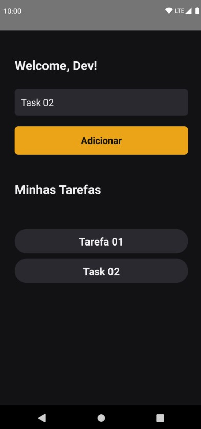

## 🎲 Running application server 

```sh
npx expo start
npx expo android
npx expo ios
npx expo web
```

## ✅ Installation 

```sh
npx create-expo-app -e with-router
npm i nativewind
npm i tailwindcss@3.3.2 --save-dev
npm i -D eslint @rocketseat/eslint-config
npm install -D prettier prettier-plugin-tailwindcss
npx expo install jest-expo jest
npm i @types/jest --save-dev
npm install --save-dev @testing-library/react-native
npx expo install @react-native-async-storage/async-storage
npm i @testing-library/react-hooks@7.0.2
```

## 📝 Documentações ultilizadas na instalação do projeto

- [Expo Router: Docs](https://expo.github.io/router)
- [Expo Router: Repo](https://github.com/expo/router)
- [Expo Dev: Unit Testing](https://docs.expo.dev/develop/unit-testing/)
- [NativeWind: Tailwind CSS](https://www.nativewind.dev/quick-starts/expo)
- [Rocketseat: ESLint config](https://github.com/Rocketseat/eslint-config-rocketseat)
- [Prettier: Tailwind CSS](https://github.com/tailwindlabs/prettier-plugin-tailwindcss)
- [Jest: Jest Getting Started](https://jestjs.io/pt-BR/docs/getting-started)
- [Jest: Jest React Native](https://jestjs.io/pt-BR/docs/tutorial-react-native)
- [Jest: Jest Expo](https://docs.expo.dev/develop/unit-testing)
- [Testing Libray: React Native](https://callstack.github.io/react-native-testing-library/docs/getting-started)
- [Async Storage: React Native](https://react-native-async-storage.github.io/async-storage/docs/install)

## 🎁 Project Images 
<p align="center">
  
  
  
</p>

